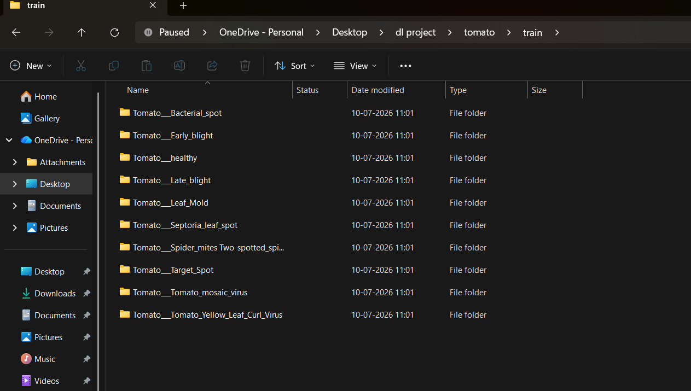
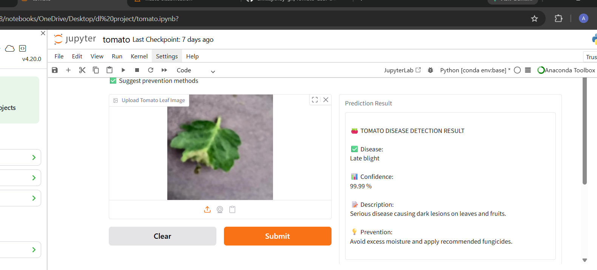
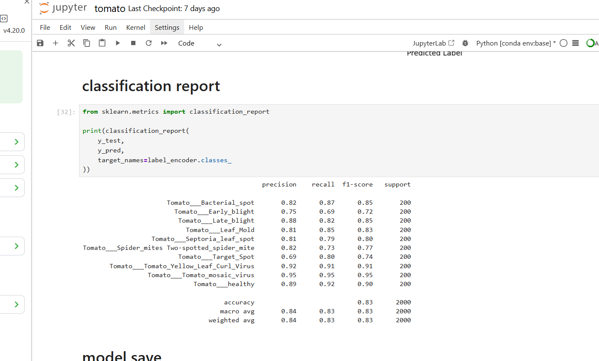

#  Tomato Leaf Disease Detection

Deep Learning based Tomato Leaf Disease Detection using **TensorFlow, Keras, and MobileNetV2**.

An intelligent Deep Learning application that detects diseases in tomato leaves from uploaded images using **TensorFlow/Keras (MobileNetV2)**. This project helps farmers and researchers identify plant diseases quickly and accurately.

---

##  Project Overview

This project classifies tomato leaf images into different disease categories using a trained **MobileNetV2** model. Users can upload a tomato leaf image and receive the predicted disease instantly.

---

##  Features

*  Detects tomato leaf diseases from images
*  Deep Learning model using MobileNetV2
*  Image upload for prediction
*  Fast and accurate classification
*  Developed using Python and Jupyter Notebook
*  Ready to be deployed as a Gradio web application

---

##  Technologies Used

| Technology       | Purpose                 |
| ---------------- | ----------------------- |
| Python           | Programming Language    |
| TensorFlow       | Deep Learning Framework |
| Keras            | Model Development       |
| MobileNetV2      | CNN Model               |
| OpenCV           | Image Processing        |
| NumPy            | Numerical Operations    |
| Matplotlib       | Data Visualization      |
| Jupyter Notebook | Model Development       |

---

##  Project Structure

```text
Tomato-Leaf-Disease-Detection/
│
├── app.py
├── tomato.ipynb
├── tomato_disease_mobilenetv2.keras
├── requirements.txt
├── README.md
│
├── dataset.png
├── training graph.png
├── accuracy.png
└── prediction.png
```

---

##  Model

* **Architecture:** MobileNetV2
* **Framework:** TensorFlow/Keras
* **Input Size:** 224 × 224 pixels

---

##  Project Workflow

1. Load Dataset
2. Image Preprocessing
3. Data Augmentation
4. Train MobileNetV2 Model
5. Model Evaluation
6. Disease Prediction

---
##  Gradio Application

This project includes a Gradio interface for tomato leaf disease prediction.

Users can upload a tomato leaf image and get:
- Predicted disease name
- Confidence score
- Disease description
- Prevention methods

### Run locally

```bash
python app.py
```

## Screenshots

### Dataset


### Model Training


### Prediction Result


### Model Accuracy


---
##  Future Enhancements

- **Improve the model accuracy** by training with a larger and more diverse tomato leaf dataset.
- **Expand the system** to detect diseases in additional crop species.
- **Integrate real-time disease detection** using a mobile phone or webcam.
- **Provide treatment recommendations** and preventive measures for each detected disease.
- **Deploy the application** as a web and mobile app for easy access by farmers.

---

##  Author

**Anitt Ajitha Y**  
Final Year Student  
**B.E. Computer Science and Engineering (Artificial Intelligence & Machine Learning)**

---

##  Project Status

* ✅ Project Completed
* ✅ Model Trained
* ✅ GitHub Repository Created

 ---
##  Acknowledgement

## 🙏 Acknowledgement

Thank you for exploring this Tomato Leaf Disease Detection project.

Feedback and suggestions are always welcome! If you have any ideas for improvement, bug reports, or questions, feel free to open an issue in this repository.
